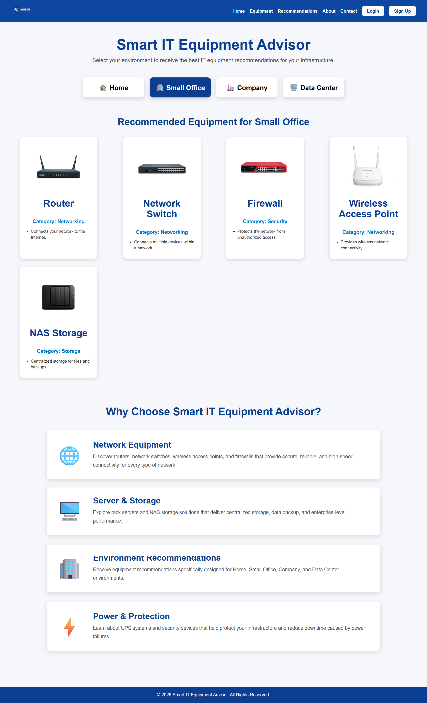
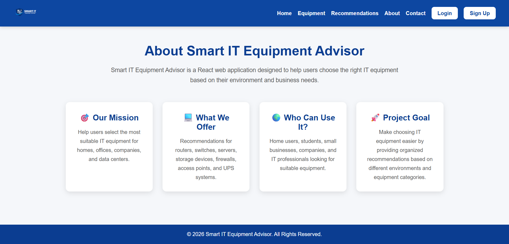
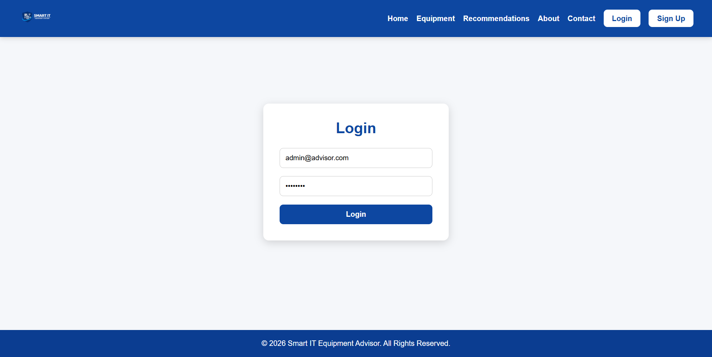
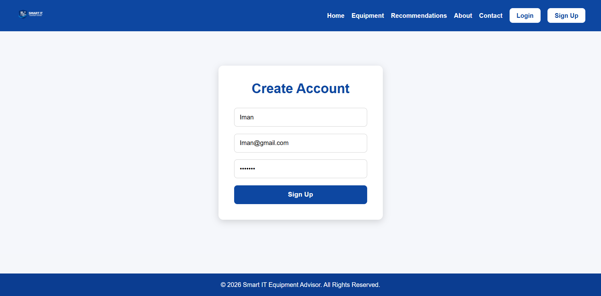
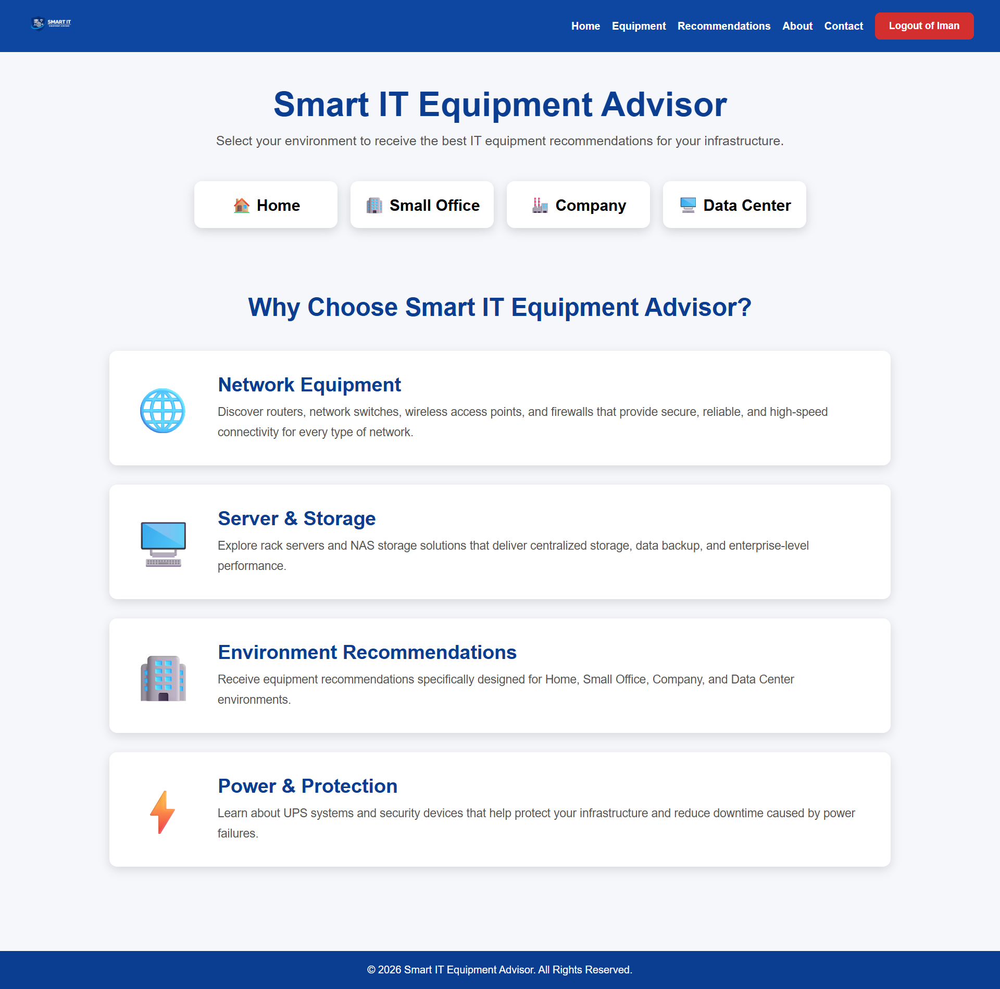
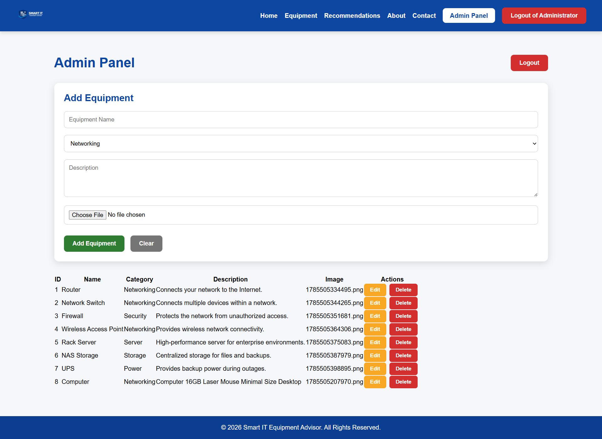
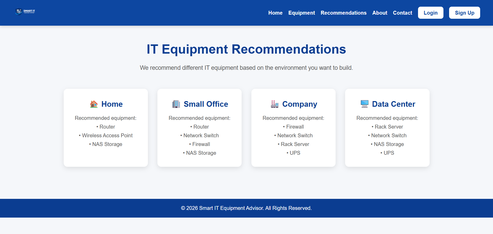
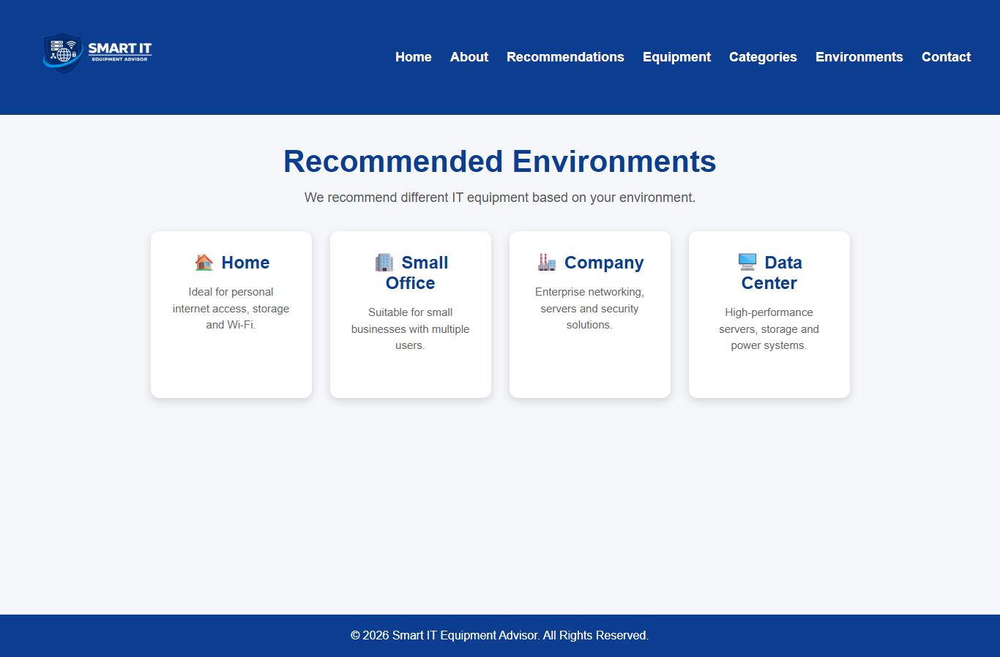
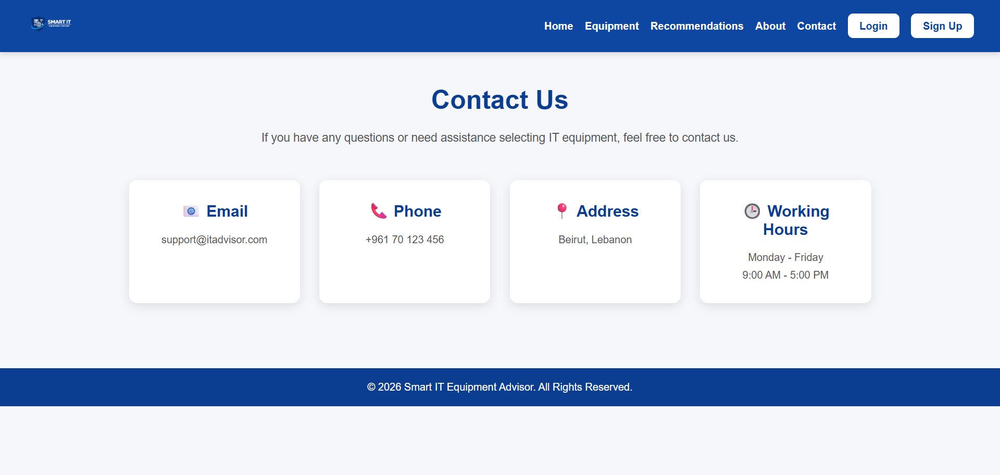

# Smart IT Equipment Advisor

## Project Description

Smart IT Equipment Advisor is a full-stack web application built with React, Node.js, Express, and MySQL. It helps users explore IT equipment, browse equipment categories, and view recommendations for different environments such as Home, Small Office, Company, and Data Center.

The system includes user authentication, an admin panel for managing equipment and categories, and image upload functionality.

---

## Technologies Used

- React.js
- Node.js
- Express.js
- MySQL
- CSS
- Git & GitHub

---

## Features

- User Login
- User Signup
- Admin Dashboard
- Equipment Management
- Category Management
- Environment Recommendations
- Image Upload
- Responsive Design

---

## Setup Instructions

### Clone the repository

```bash
git clone https://github.com/talalazzam/Smart-IT-Equipment-Advisor.git
```

### Install frontend dependencies

```bash
cd frontend
npm install
```

### Install backend dependencies

```bash
cd ../backend
npm install
```

### Configure MySQL

Create a MySQL database and import the provided SQL file.

Update your database connection inside the backend configuration file.

### Start the backend

```bash
node server.js
```

### Start the frontend

```bash
cd ../frontend
npm start
```

The application will run at:

```
http://localhost:3000
```

---

# Screenshots

## Home



## About



## Login



## Signup



## Logged In



## Admin Panel



## Equipment


## Categories


## Recommendations



## Environments



## Contact


