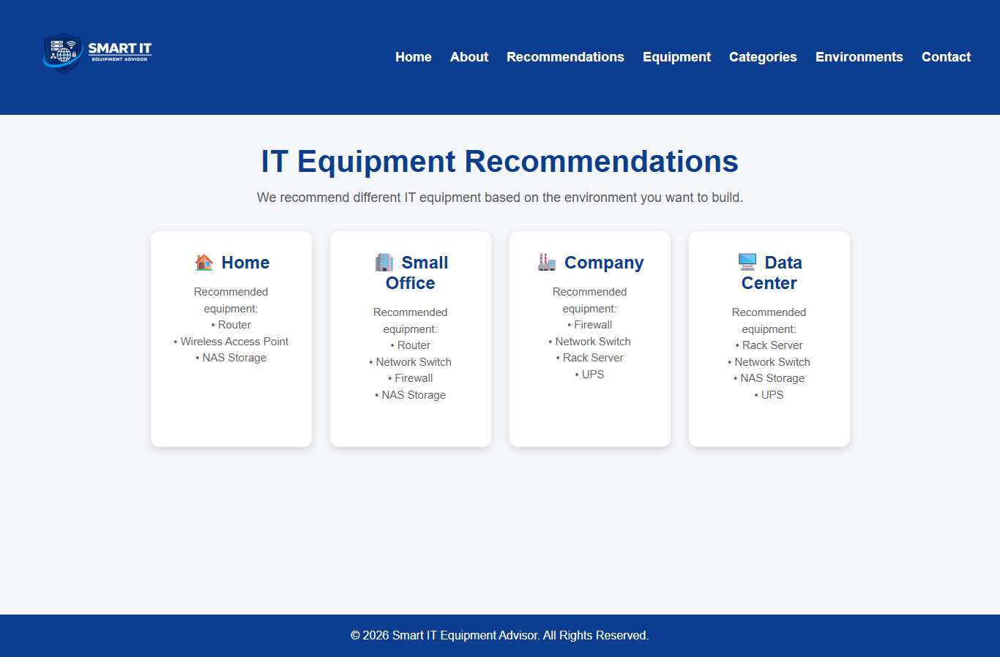
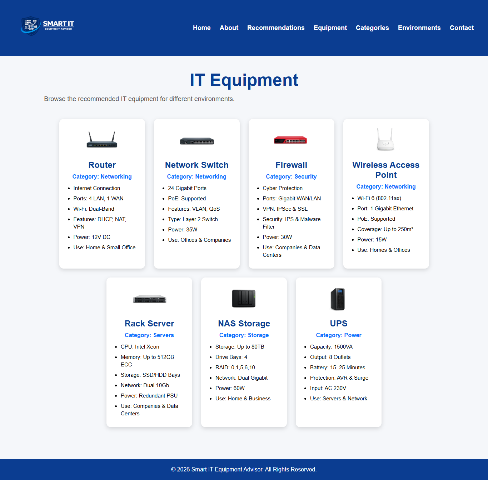
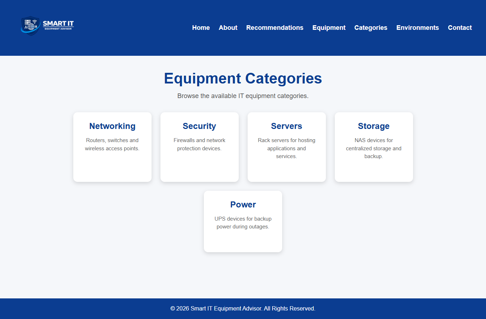

# Smart IT Equipment Advisor

## Project Description

Smart IT Equipment Advisor is a React web application designed to help users choose suitable IT equipment based on different environments. The application recommends networking, security, storage, server, and power equipment for Home, Small Office, Company, and Data Center environments.

---

## Features

- Home page introducing the project
- About page
- IT equipment recommendations based on environment
- Equipment Categories page
- Equipment page with technical specifications
- Environments page
- Contact page
- Responsive and user-friendly interface

---

## Technologies Used

- React.js
- React Router DOM
- JavaScript (ES6)
- HTML5
- CSS3

---

## Setup Instructions

### Clone the repository

```bash
git clone https://github.com/talalazzam/Smart-IT-Equipment-Advisor.git
```

### Open the project folder

```bash
cd Smart-IT-Equipment-Advisor
```

### Install dependencies

```bash
npm install
```

### Start the application

```bash
npm start
```

The application will run locally at:

```
http://localhost:3000
```

---

## Project Structure

```
Smart-IT-Equipment-Advisor/
│
├── public/
├── screenshots/
│   ├── home.png
│   ├── about.png
│   ├── recommendations.png
│   ├── equipment.png
│   ├── categories.png
│   ├── environments.png
│   └── contact.png
│
├── src/
│   ├── assets/
│   ├── components/
│   ├── pages/
│   ├── styles/
│   ├── App.js
│   └── index.js
│
├── package.json
├── package-lock.json
└── README.md
```

---

# Screenshots

## Home Page


---

## About Page


---

## Recommendations Page



---

## Equipment Page



---

## Equipment Categories Page



---

## Environments Page


---

## Contact Page


---

## Live Demo

The application is deployed on Vercel:

https://smart-it-equipment-advisor-three.vercel.app

---

## GitHub Repository

https://github.com/talalazzam/Smart-IT-Equipment-Advisor

---

## Author

**Talal Azzam**

---

## License

This project was developed for educational purposes as part of an Advanced Web Programming course.
